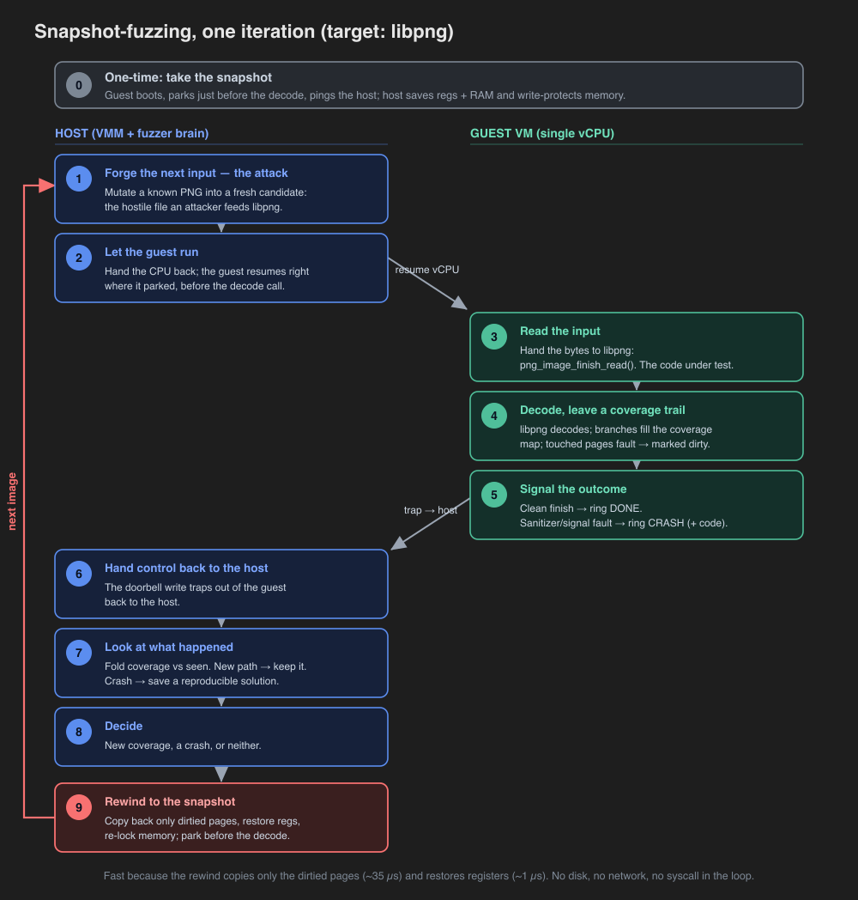

# How snapshot fuzzing works

In-VMM snapshot fuzzer for `ignition` (Firecracker-modeled microVM on Apple
Hypervisor.framework). The fuzzer parks the guest at a parse entry, injects
inputs into a shared window, runs the target, and resets the guest to the
snapshot every iteration via `hv_vm_protect` dirty-page tracking, all without
leaving the VMM. This is the M3 benchmark: real libpng-current as the target,
single core.

Date: 2026-06-14. Host: Apple Silicon, macOS 26.5. Guest: aarch64, 128 MiB,
single vCPU, 16 KiB page granule. Target: libpng 1.6.43 + zlib 1.3.1, built with
SanCov edge coverage, no AddressSanitizer (see Methodology).

## Throughput and reset

| Metric | libpng (dirty reset) | libpng (full-copy reset) |
|--------|---------------------:|-------------------------:|
| Steady-state execs/sec | 1309 | 271 |
| Reset latency p50 | 36 us | — |
| Reset latency p99 | 60 us | — |
| page-copy p50 | 35 us | — |
| register-restore p50 | 1 us | — |

Dirty reset is 4.8x the full-copy reset on the same target. The reset cost is
dominated by the page copy; register restore is about 1 us.

## Dirty-set size (pages dirtied per iteration, 16 KiB each)

| p50 | p99 | max |
|----:|----:|----:|
| 44 | 50 | 50 |

The dirty set is what the reset copies back; it explains the page-copy latency
above and feeds the [diff-snapshot work](../features/diff-snapshots.md).

## Coverage

Distinct edges hit: 144 (SanCov `trace-pc`, hashed into the reset-exempt
coverage window). The coverage-over-time curve is the `covsample` series in the
metrics file (`--metrics`).

## Correctness (deterministic)

Time-to-rediscover the planted heap overflow (synthetic ASan target, a
CVE-shaped chunk parser): 0.002 s from a seed corpus, deterministically
replayable from the saved input (`--replay`). This is the M1 correctness number,
re-measured here as the deterministic anchor alongside the throughput numbers.

## Methodology

- Coverage-only libpng build. The throughput, reset, and dirty-set numbers come
  from a SanCov-only libpng build (no ASan). Per the design's section 12 risk
  note, ASan shadow (1/8 of the working set) joins the dirty set and inflates
  reset; a coverage-only build isolates the snapshot machinery. The deterministic
  bug-finding number uses the separate ASan build.
- Single core, steady state. execs/sec is measured over a fixed wall-clock window
  after warm-up; SIGINT triggers a clean metrics flush.
- Reproduce: `M3_DURATION=60 python3 scripts/fuzz_m3_bench.py` (needs a signed
  `boot`, `kimage/out/Image`, and both fuzz initramfs images; see
  `REBUILD-GUEST-ASSETS.md`).

See [Running the fuzzer](running.md) for the build, the gate scripts, and every
`boot --fuzz` flag.

## Related

- [Running the fuzzer](running.md) — gates, flags, and the benchmark driver.
- [The clone primitive](../concepts/clone-primitive.md) — the in-loop `reset()` this loop depends on.
- [Snapshot-fuzzing benchmark](../benchmarks/fuzzing.md) — the throughput numbers.
